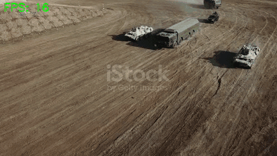
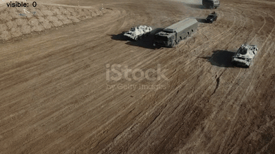
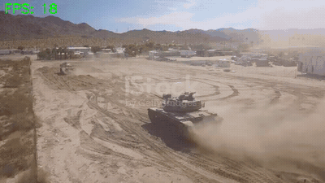
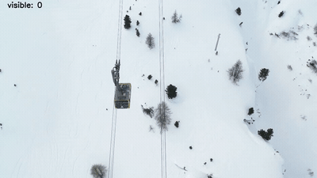

# Tank & Cable-Car Detection + Multi-Object Tracking Pipeline

End-to-end pipeline for detecting and tracking military vehicles (and cable cars)
in video - from **automatic annotation** to **YOLO training** to real-time
**multi-object tracking**, with two deployment targets:

| Target | Implementation | Detector | Tracking FPS |
|--------|---------------|----------|--------------|
| **Workstation (PC)** | Python ([`pc_pipeline/`](pc_pipeline/)) | YOLOv8 / YOLO26 (PyTorch) | ~36 FPS |
| **Jetson AGX Orin** | C++ / TensorRT ([`jetson_pipeline/`](jetson_pipeline/)) | YOLO26n FP16 TRT | **~93 FPS** |

## Demos

| Jetson C++ - 93 FPS (smoothed) | PC FastMOT + PyTorch ReID |
|:---:|:---:|
|  |  |
| **Jetson C++ - single tank** | **Cable-car detector** |
|  |  |

Full-resolution clips (all scenes) in [`demos/`](demos/).

---

## Pipeline Overview

```
Raw video
   |
   v
[1] LocateAnything-3B  (annotation/)
    Open-vocabulary VLM auto-labels objects by text prompt
    ("military tank", "armored vehicle", ...) -> YOLO-format boxes
   |
   v
[2] Dataset build
    NMS dedup, class collapse, train/val split, multi-video merge
   |
   v
[3] YOLO training  (training/train.py)
    YOLOv8n / YOLO26n, heavy augmentation
   |
   +--> PC:     Python FastMOT  (pc_pipeline/)
   |            YOLO + Kalman + KLT optical flow + PyTorch ReID
   |
   +--> Jetson: C++ TensorRT  (jetson_pipeline/)
                YOLO26n FP16 engine + Kalman + KLT, no Python overhead
```

---

## 1. Annotation - `annotation/`

Uses NVIDIA's **LocateAnything-3B** (Eagle/Embodied) - an open-vocabulary
vision-language model - to auto-label objects by text description. No manual
bounding boxes required.

```bash
# Clone + install LocateAnything (downloads ~7 GB model on first run)
bash annotation/setup_locateanything.sh

# Annotate a video -> YOLO dataset
python annotation/annotate_video_locate.py \
    --video tank.mp4 \
    --classes "military tank" "armored vehicle" "battle tank" \
    --out dataset_tank/ \
    --stride 1 --min-area 0.0001
```

The model is loaded **8-bit quantized** (`load_in_8bit=True`) - fits in ~4.5 GB
VRAM, leaving room for inference on a 12 GB GPU. For 4K video, frames are
downscaled to <=1280 px for inference only (full-res images are still saved).

> **Note:** The LocateAnything-3B model weights are **not** included in this repo -
> they are auto-downloaded from HuggingFace (`nvidia/LocateAnything-3B`).

---

## 2. Training - `training/`

```bash
# model can be yolo26n.pt or yolov8n.pt
python training/train.py \
    --data dataset_tank/data.yaml \
    --model yolo26n.pt \
    --epochs 100 --imgsz 640 --batch 16 \
    --name tank_yolo26n
```

Heavy augmentation (mosaic, mixup, rotation, HSV jitter, copy-paste) compensates
for small datasets. Domain adaptation across video types (aerial vs side-view) is
done by annotating each domain and merging.

### Training Results

| Model | mAP@50 | mAP@50-95 | Precision | Recall |
|-------|:------:|:---------:|:---------:|:------:|
| Tank - YOLO26n | 0.928 | **0.799** | 0.923 | 0.892 |
| Tank - YOLOv8n (merged) | **0.939** | 0.790 | 1.000 | 0.851 |
| Cable-car - YOLOv8n | 0.891 | 0.393 | 0.964 | 0.792 |

**Tank YOLO26n training curves & PR curve:**

| Loss / mAP over epochs | Precision-Recall |
|:---:|:---:|
|  |  |

**Full metrics, confusion matrices, and sample predictions for all three
models -> [results/README.md](results/README.md)**

Pre-trained weights are in [`weights/`](weights/):
- `tank_yolo26n.pt` - YOLO26n tank detector
- `tank_yolov8n.pt` - YOLOv8n tank detector
- `cablecar_yolov8n.pt` - cable-car detector

---

## 3a. PC Tracking (Python) - `pc_pipeline/`

A modified [FastMOT](https://github.com/GeekAlexis/FastMOT) with three custom
components (see [pc_pipeline/CHANGES.md](pc_pipeline/CHANGES.md)):

- **`UltralyticsDetector`** - wraps any ultralytics YOLO (.pt or .engine) into
  FastMOT's async detector interface, with second-stage NMS.
- **`TorchFeatureExtractor`** - PyTorch MobileNetV3 ReID (replaces the broken
  TensorRT-7 OSNet). Graceful fallback: TRT -> PyTorch -> IoU-only.
- **GPU/headless fixes** - auto GStreamer detection, mp4v codec fallback,
  numba/coverage compatibility.

```bash
cd pc_pipeline
./track_tank.sh input.mp4 # tank tracking -> H.264 output
./track_cablecar.sh input.mp4 # cable-car tracking
```

## 3b. Jetson Tracking (C++ / TensorRT) - `jetson_pipeline/`

A from-scratch C++ pipeline with **zero Python overhead** for maximum throughput
on Jetson AGX Orin:

- **CUDA preprocessing** - letterbox + normalize kernel ([`preprocess.cu`](jetson_pipeline/src/preprocess.cu))
- **TensorRT FP16 inference** - YOLO26n end-to-end (NMS in engine)
- **Kalman + KLT tracker** - SORT-style, with EMA box smoothing
- **~93 FPS** full pipeline (vs 36 FPS Python) - **2.8x speedup**

```bash
cd jetson_pipeline && mkdir build && cd build
cmake .. && make -j
./tank_tracker <engine.path> <input.mp4> <output.mp4> [conf] [det_skip]
```

See [jetson_pipeline/README.md](jetson_pipeline/README.md) for engine export and
the convenience wrapper that runs remotely and copies results back.

---

## Performance Summary (Jetson AGX Orin, max clocks)


### Detection only
| Precision | FPS | Speedup |
|-----------|-----|---------|
| FP32 PyTorch | 37 | 1.0x |
| FP16 TRT | **133** | 3.6x |
| INT8 TRT | 98 | 2.6x |

### Full tracking pipeline
| Implementation | FPS |
|----------------|-----|
| Python FastMOT (FP16 TRT) | 36 |
| **C++ TensorRT** | **93** |

---

## Repository Layout

```
annotation/        LocateAnything auto-annotation (code only, model auto-downloads)
training/          YOLO training + dataset conversion scripts
pc_pipeline/       Python FastMOT (modified), workstation tracking
jetson_pipeline/   C++ TensorRT pipeline + pre-built engines, Jetson deployment
weights/           Pre-trained YOLO detectors (.pt)
results/           Training curves, PR/confusion plots, benchmark charts
docs/              Architecture slides
```

## Acknowledgements

- [LocateAnything / Eagle](https://github.com/NVlabs/Eagle) - NVIDIA Labs (annotation)
- [FastMOT](https://github.com/GeekAlexis/FastMOT) - base multi-object tracker
- [Ultralytics YOLO](https://github.com/ultralytics/ultralytics) - detection
