# Training Results & Metrics

Final validation metrics (best epoch) for each trained detector:

| Model | Epochs | mAP@50 | mAP@50-95 | Precision | Recall |
|-------|:------:|:------:|:---------:|:---------:|:------:|
| **Tank - YOLO26n** | 100 | 0.928 | **0.799** | 0.923 | 0.892 |
| **Tank - YOLOv8n** (merged) | 60 | **0.939** | 0.790 | 1.000 | 0.851 |
| **Cable-car - YOLOv8n** | 100 | 0.891 | 0.393 | 0.964 | 0.792 |

> YOLO26n reaches the highest **mAP@50-95** (tighter boxes) thanks to its
> `reg_max=1` regression head; YOLOv8n edges ahead on mAP@50.

---

## Jetson AGX Orin - Inference Benchmark

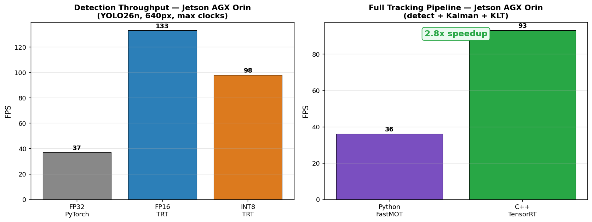

FP16 TensorRT gives the best detection throughput (133 FPS); the full C++
tracking pipeline runs **2.8x faster** than the Python implementation.

---

## Tank Detector - YOLO26n

| Training curves | Precision-Recall |
|:---:|:---:|
| 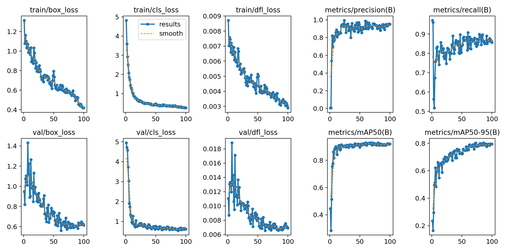 | 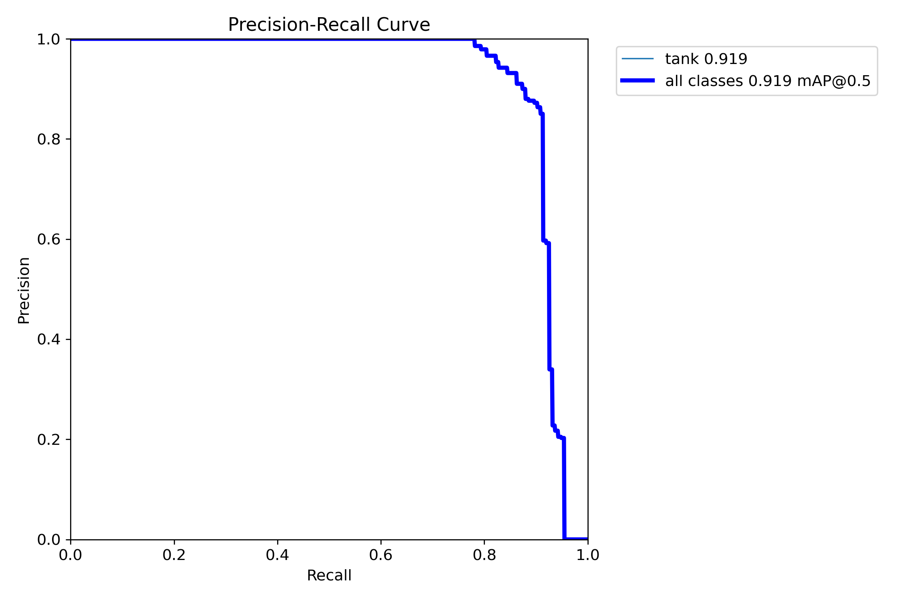 |

| Confusion matrix | Validation predictions |
|:---:|:---:|
| 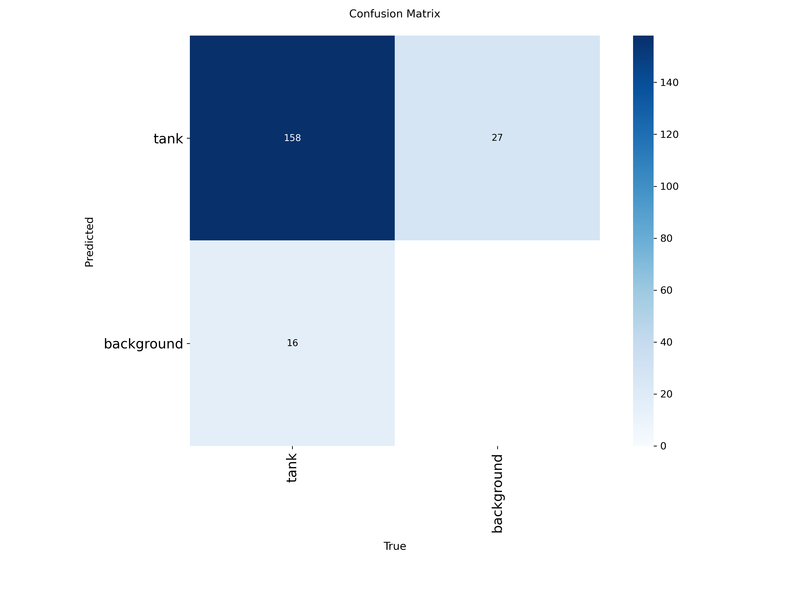 | 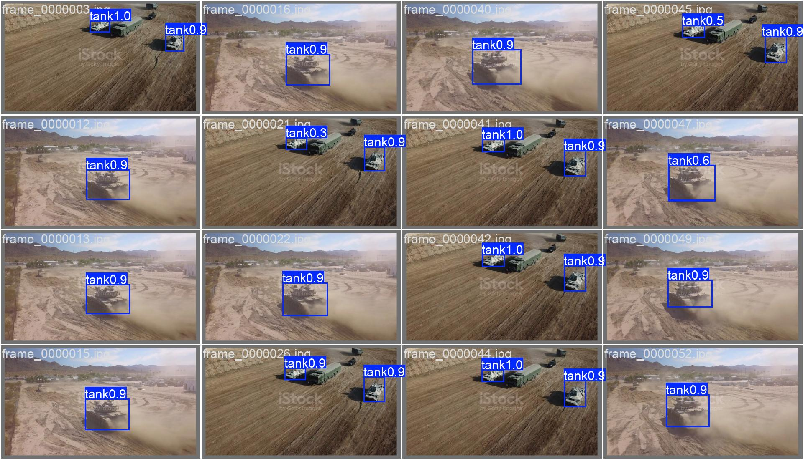 |

---

## Tank Detector - YOLOv8n (multi-domain merged dataset)

| Training curves | Precision-Recall |
|:---:|:---:|
| 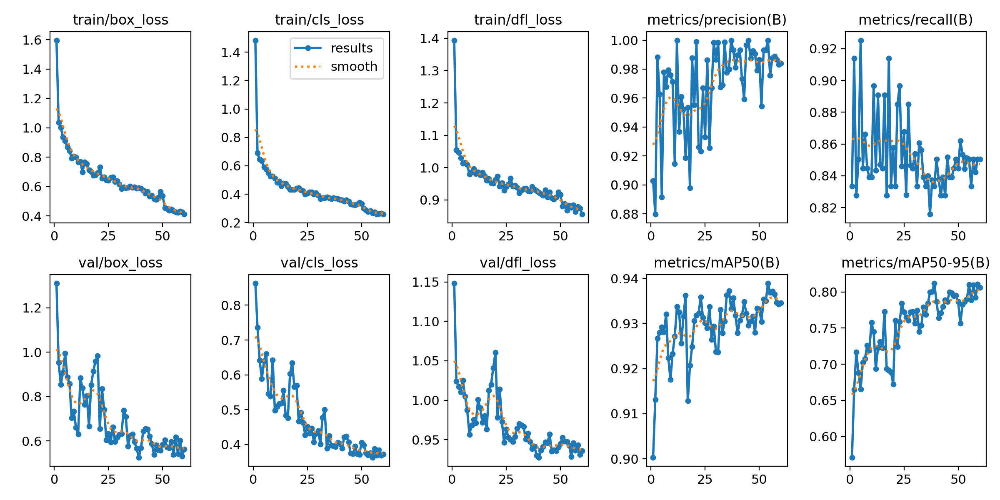 | 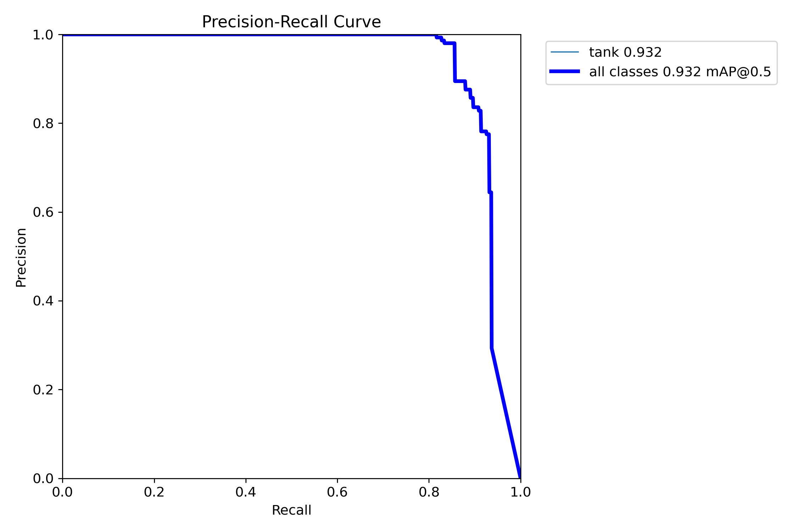 |

| Confusion matrix | Validation predictions |
|:---:|:---:|
| 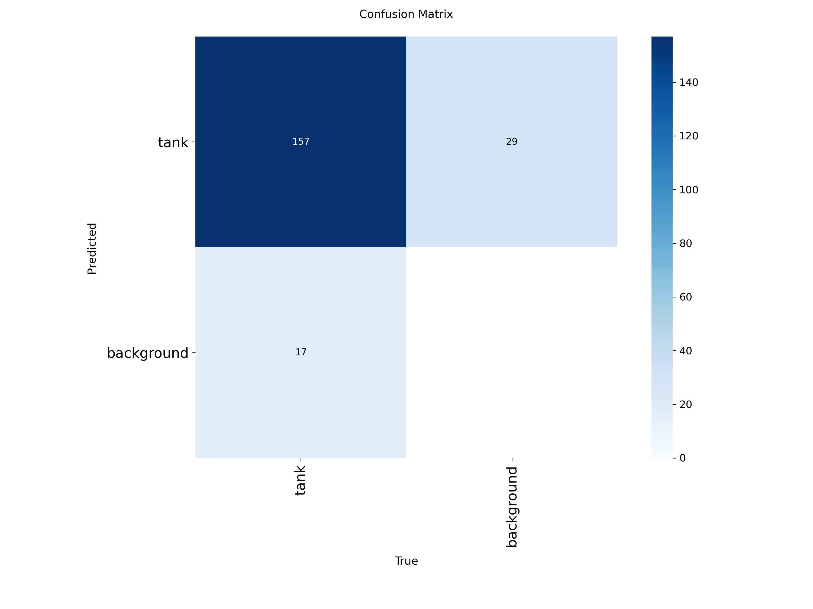 | 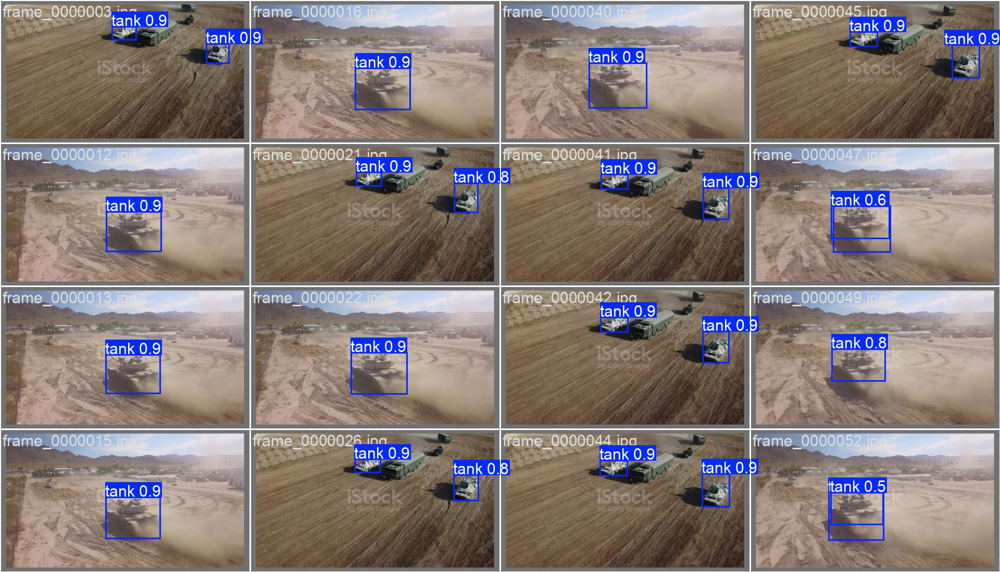 |

---

## Cable-Car Detector - YOLOv8n

| Training curves | Precision-Recall |
|:---:|:---:|
| 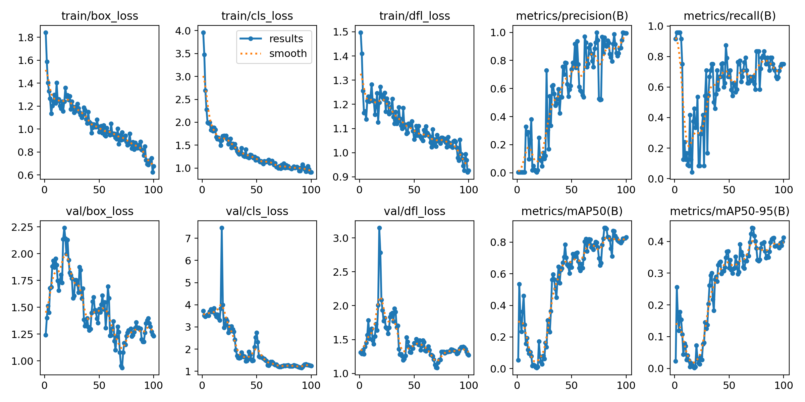 | 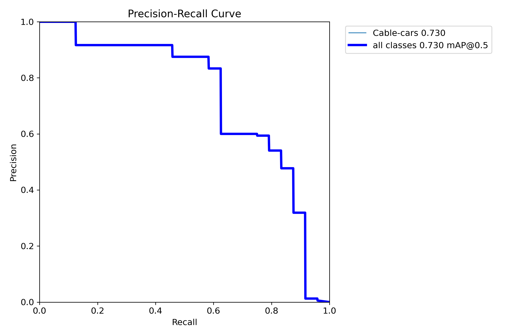 |

| Validation predictions |
|:---:|
| 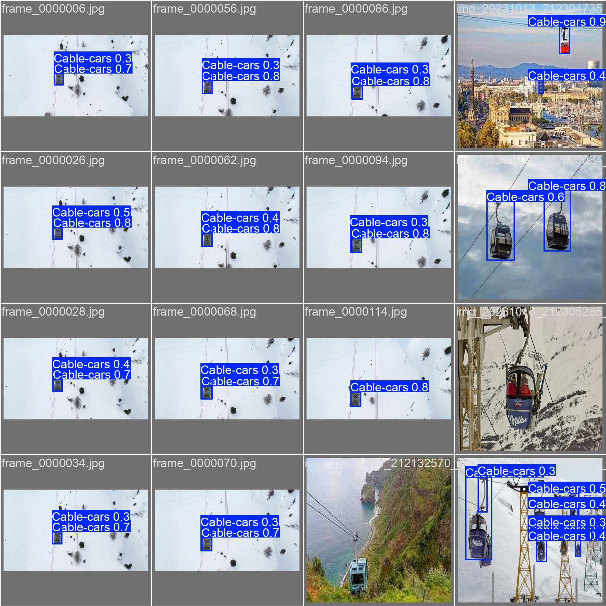 |

---

*Plots auto-generated by Ultralytics during training (`results.png`,
`BoxPR_curve.png`, `confusion_matrix.png`, `val_batch0_pred.jpg`).*
